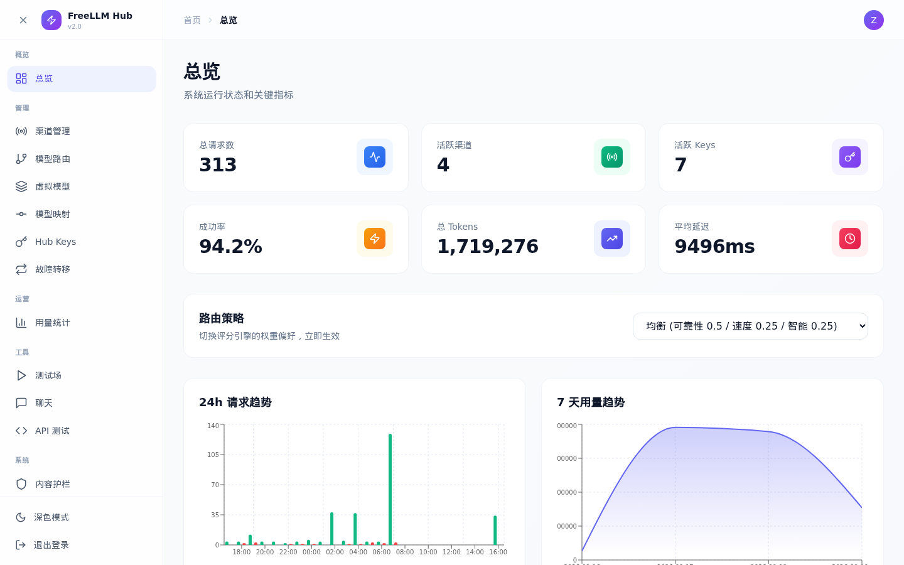
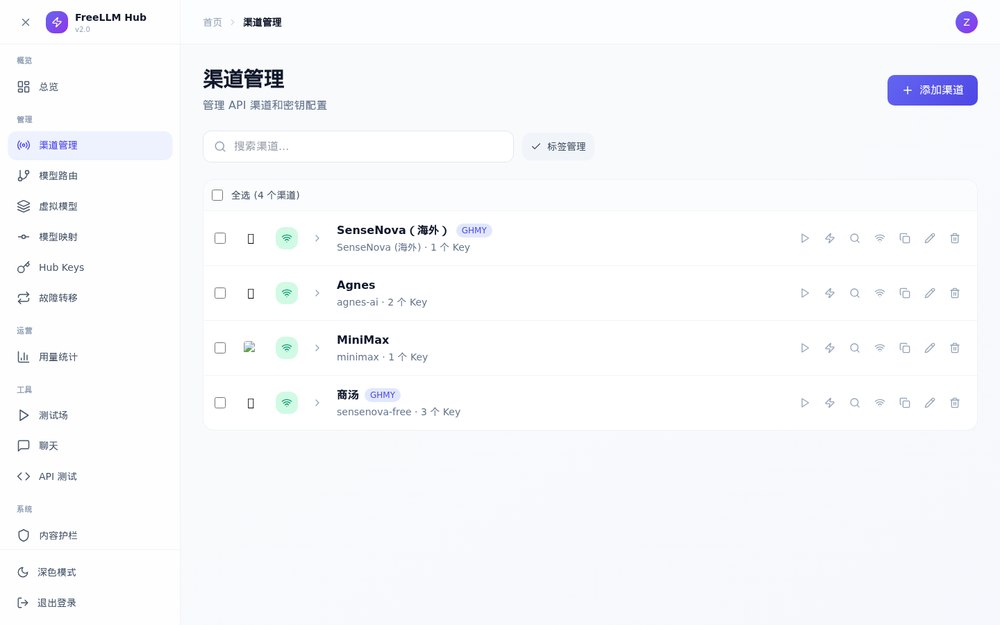
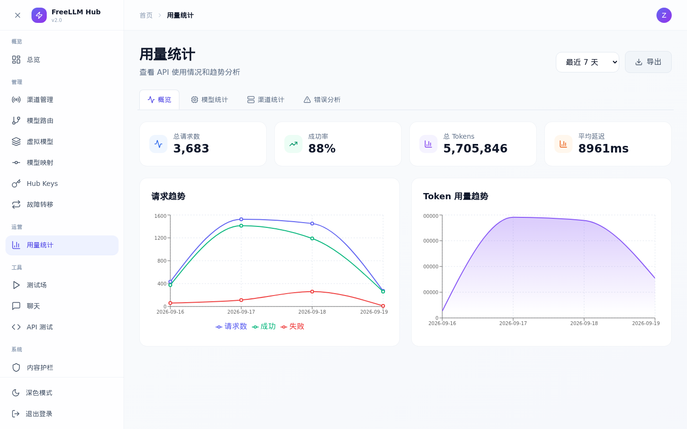
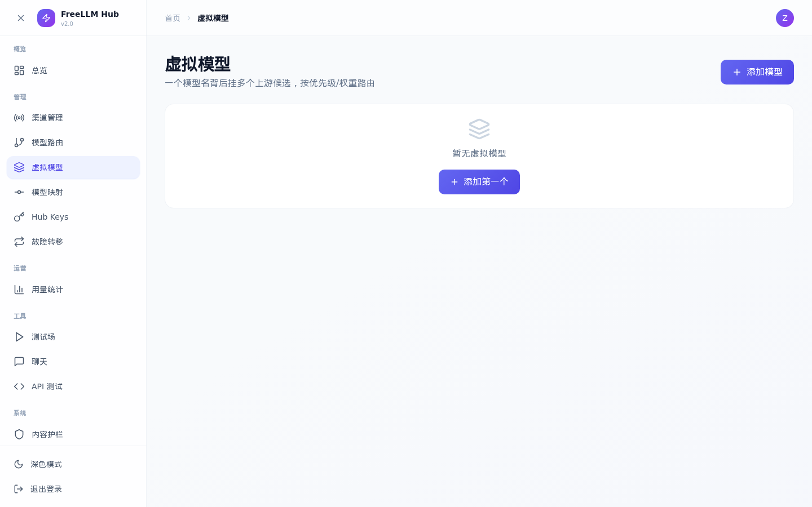
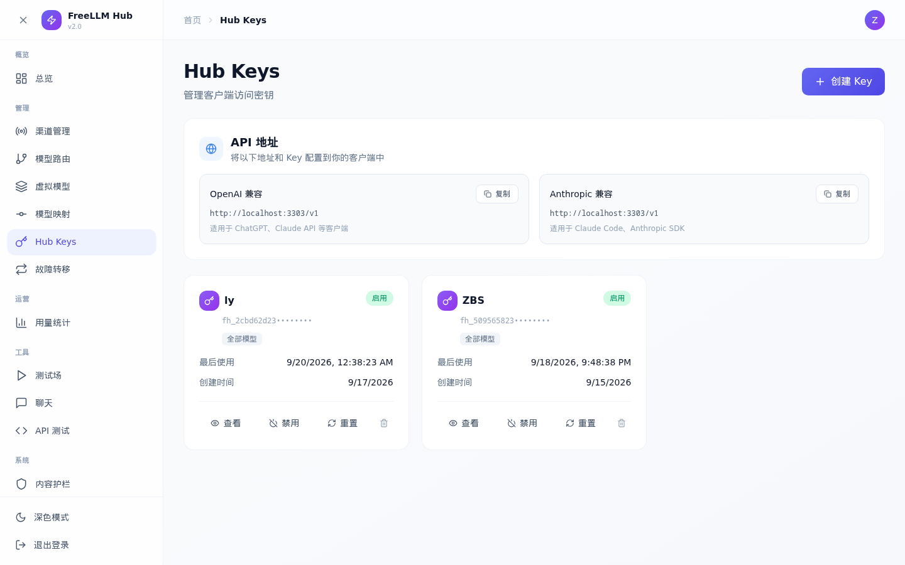
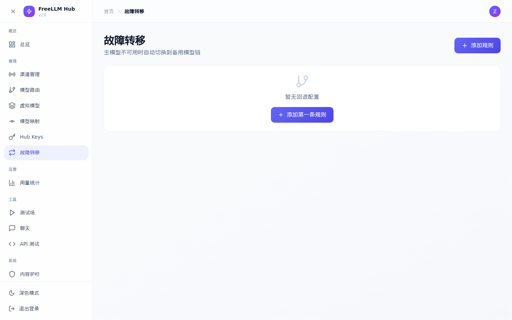
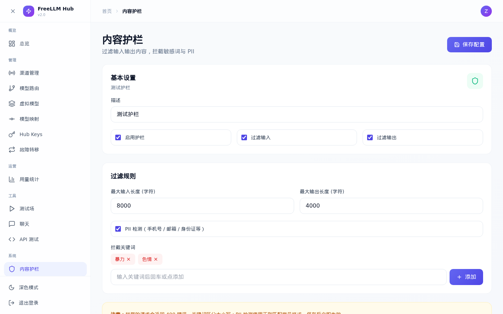

# FreeLLM Hub v2

> **自托管的统一 LLM API 网关** — OpenAI / Anthropic / Gemini / DeepSeek / 商汤 / Agnes / MiniMax 等所有大模型 Key 统一收进来，一个地址到处用。

[](./LICENSE)
[](https://nodejs.org)
[](https://hub.docker.com)
[](./CHANGELOG.md)

[English](#english) | [中文](#中文)

---

## 📸 截图预览

<details>
<summary><b>🏠 总览 Dashboard</b></summary>



实时统计、24h 请求趋势图、路由策略调节。
</details>

<details>
<summary><b>🔌 渠道管理</b></summary>



统一管理所有 Provider 的渠道、API Key、限速和标签。
</details>

<details>
<summary><b>📊 用量统计</b></summary>



多维度分析：模型统计、渠道统计、错误分析、日志明细。
</details>

<details>
<summary><b>🧩 虚拟模型</b></summary>



一个模型名背后挂多个上游候选（Key + 模型 + 优先级 + 权重 + 置顶）。
</details>

<details>
<summary><b>🔑 Hub Keys</b></summary>



管理客户端 Key，可限定每个 Key 可调用的模型。
</details>

<details>
<summary><b>🔄 故障转移</b></summary>



主模型 → 备用模型链，支持顺序 / 加权 / 优先级三种策略。
</details>

<details>
<summary><b>🛡️ 内容护栏</b></summary>



输入 / 输出过滤、关键词拦截、PII 检测、长度限制。
</details>

---

## 中文

### ✨ 它能做什么

把散落在各处的 API Key 统一收到一个网关后面，给所有 Agent 工具提供**一个 Base URL + 一个 Key**，免去每个工具都配一遍的痛苦。

- 🔑 **多 Provider 多 Key 管理** — 16+ Provider，内置 MiniMax / Agnes / DeepSeek / 商汤 / OpenAI / Anthropic / Gemini 等适配器
- 🛡️ **故障转移 + 冷却** — 主模型挂了自动切备用模型，失败的 Key 自动封禁
- 🎯 **路由策略** — 模型映射（请求模型 → 实际模型）+ 虚拟模型（一个名字背后挂多个候选）+ 模型路由
- 🔐 **零妥协安全** — AES-256-GCM 加密所有上游 Key，bcrypt 管理员密码，Hub Key + 模型白名单
- 📊 **完整可观测性** — 每次请求都追踪，失败原因清晰可见
- 🪶 **极轻部署** — 单 Docker 容器 + SQLite (Node 22+ 内置)，**零 native 依赖**

### 🚀 30 秒启动

```bash
mkdir -p ~/freellm-hub && cd ~/freellm-hub
docker run -d \
  --name freellm-hub \
  --restart unless-stopped \
  -p 3030:3030 \
  -v $(pwd)/data:/app/data \
  -e TZ=Asia/Shanghai \
  ghcr.io/zhibushi/freellm-hub-v2:v2.0.0

# 等几秒后访问
open http://localhost:3030
```

首次进入会引导你注册管理员账号 → 添加 Provider → 创建 Hub Key → 完成。

📚 详细安装指南：[INSTALL.md](./INSTALL.md) | 运维升级指南：[DEPLOY.md](./DEPLOY.md)

### 🛠️ 在 Agent 里配置

| 工具 | Base URL | API Key |
|---|---|---|
| **OpenAI 兼容** (Cline, ChatBox, DeepSeek Harness, Hermes Agent, etc.) | `http://your-hub:3030/v1` | `fh_<64hex>` |
| **Anthropic 兼容** (Claude Code, Hermes Agent, etc.) | `http://your-hub:3030` | 同上 |
| **OpenAI Responses** (Codex CLI, Agents SDK 2024-09+) | `http://your-hub:3030/v1` | 同上 |

### 📦 支持的接口

**客户端接口**（任何兼容 SDK 都能接）：

| 接口 | 兼容性 | 说明 |
|---|---|---|
| `POST /v1/chat/completions` | OpenAI | 聊天（含流式 SSE） |
| `POST /v1/messages` | Anthropic | Claude Code 等，含 tool_use 双向转换 |
| `POST /v1/responses` | OpenAI Responses | Codex CLI 等 |
| `POST /v1/embeddings` | OpenAI | 向量嵌入 |
| `POST /v1/images/generations` | OpenAI | 文生图 |
| `POST /v1/images/edits` | OpenAI | 图生图/编辑 |
| `POST /v1/audio/speech` | OpenAI TTS | 文本转语音 |
| `POST /v1/audio/transcriptions` | OpenAI Whisper | 语音转文字 |
| `POST /v1/videos/generations` | 自定义 (MiniMax/Agnes) | 文生视频（异步） |
| `POST /v1/videos/edits` | 自定义 | 图生视频 |
| `GET /v1/videos/tasks/:taskId` | 自定义 | 轮询视频任务状态 |
| `GET /v1/models` | OpenAI | 列出可用模型 |

**管理接口**（需 admin session）：13 个页面，95 个 API，详见后端 `/api-docs` 端点。

### 🖼️ 管理后台

完整 React SPA，**移动端完全适配 + 暗色模式**，14 个页面：

| 类别 | 页面 |
|---|---|
| 概览 | 总览 |
| 管理 | 渠道管理、模型路由、虚拟模型、模型映射、Hub Keys、故障转移 |
| 运营 | 用量统计 |
| 工具 | 测试场、聊天、API 测试 |
| 系统 | 内容护栏、响应缓存、个人资料 |

### 🏗️ 架构

```
┌─────────────────────────────────────┐
│  Agent / SDK (Cline, Claude Code)   │
│  OpenAI / Anthropic / Responses 兼容 │
└──────────────┬──────────────────────┘
               │ HTTPS, Bearer fh_...
               ▼
┌─────────────────────────────────────┐
│        FreeLLM Hub (Fastify)         │
├─────────────────────────────────────┤
│  Auth  → Hub Key 验证 + 模型白名单   │
│  Route → 故障转移 + 冷却 + 路由      │
│  Cache → 响应缓存 (可选)            │
│  Guard → 内容护栏 (可选)            │
└──────────────┬──────────────────────┘
               │ HTTPS, 上游 Key (AES 解密后注入)
               ▼
┌─────────────────────────────────────┐
│  上游 Provider × 16                  │
│  MiniMax / Agnes / OpenAI / Anthropic│
│  DeepSeek / 商汤 / Gemini / ...      │
└─────────────────────────────────────┘
```

### 📋 系统要求

- **Docker** 20.10+（推荐）
- 或 **Node.js** 22+（从源码运行）
- **1 GB** RAM 起步
- **1 GB** 磁盘 (SQLite + 自动备份)

### 🛣️ 路线图

✅ **v2.0.0**（当前）— 多 Provider、路由、缓存、护栏、备份、移动端  
🚧 **v2.1** — OpenAPI 文档、Prometheus 指标  
💭 **v3.0** — 多用户/团队、SSO、计费系统

完整变更：[CHANGELOG.md](./CHANGELOG.md)

### 🤝 致谢

- 灵感：[one-api](https://github.com/songquanpeng/one-api) — 成熟企业级网关
- 灵感：[FreeLLM API](https://github.com/tashfeenahmed/freellmapi) — 极简聚合 UI
- 设计：[Anthropic Messages API](https://docs.anthropic.com) / [OpenAI Responses API](https://platform.openai.com)

### 📄 许可证

MIT — 详见 [LICENSE](./LICENSE)

---

## English

### ✨ What it does

A self-hosted LLM API gateway that unifies all your API keys behind one endpoint. One Base URL, one Key, for every Agent tool.

- 🔑 **Multi-Provider Key Management** — 16+ providers with built-in adapters for MiniMax, Agnes, DeepSeek, SenseNova, OpenAI, Anthropic, Gemini, etc.
- 🛡️ **Failover + Cooldown** — Automatic fallback when primary fails, automatic quarantine of broken keys
- 🎯 **Routing Policies** — Model aliasing, virtual models (one name → multiple candidates), model routes
- 🔐 **Zero-compromise Security** — AES-256-GCM encryption for upstream keys, bcrypt admin password, Hub Keys with model allow-lists
- 📊 **Full Observability** — Every request tracked, failure reasons visible
- 🪶 **Minimal Footprint** — Single Docker container + SQLite (Node 22+ built-in), **zero native dependencies**

### 🚀 30-second start

```bash
mkdir -p ~/freellm-hub && cd ~/freellm-hub
docker run -d \
  --name freellm-hub \
  --restart unless-stopped \
  -p 3030:3030 \
  -v $(pwd)/data:/app/data \
  -e TZ=Asia/Shanghai \
  ghcr.io/zhibushi/freellm-hub-v2:v2.0.0

# Wait a few seconds, then open
open http://localhost:3030
```

First visit guides you through admin registration → adding a Provider → creating a Hub Key → done.

📚 Detailed guides: [INSTALL.md](./INSTALL.md) | [DEPLOY.md](./DEPLOY.md)

### 🛠️ Configure your Agent

| Tool | Base URL | API Key |
|---|---|---|
| **OpenAI-compatible** (Cline, ChatBox, DeepSeek Harness, Hermes Agent, etc.) | `http://your-hub:3030/v1` | `fh_<64hex>` |
| **Anthropic-compatible** (Claude Code, Hermes Agent, etc.) | `http://your-hub:3030` | Same |
| **OpenAI Responses** (Codex CLI, Agents SDK 2024-09+) | `http://your-hub:3030/v1` | Same |

### 📦 Supported APIs

**Client APIs** (any compatible SDK works):

| Endpoint | Compatibility | Notes |
|---|---|---|
| `POST /v1/chat/completions` | OpenAI | Chat (with SSE streaming) |
| `POST /v1/messages` | Anthropic | Claude Code etc., incl. tool_use |
| `POST /v1/responses` | OpenAI Responses | Codex CLI etc. |
| `POST /v1/embeddings` | OpenAI | Vector embeddings |
| `POST /v1/images/generations` | OpenAI | Text-to-image |
| `POST /v1/images/edits` | OpenAI | Image-to-image/edit |
| `POST /v1/audio/speech` | OpenAI TTS | Text-to-speech |
| `POST /v1/audio/transcriptions` | OpenAI Whisper | Speech-to-text |
| `POST /v1/videos/generations` | Custom (MiniMax/Agnes) | Text-to-video (async) |
| `POST /v1/videos/edits` | Custom | Image-to-video |
| `GET /v1/videos/tasks/:taskId` | Custom | Poll video task status |
| `GET /v1/models` | OpenAI | List available models |

**Admin APIs** (require admin session): 13 pages, 95 endpoints. See backend `/api-docs`.

### 🖼️ Admin Dashboard

Full React SPA, **fully mobile-responsive + dark mode**, 14 pages:

| Category | Pages |
|---|---|
| Overview | Dashboard |
| Management | Channels, Model Routes, Virtual Models, Model Mappings, Hub Keys, Fallback |
| Operations | Usage Statistics |
| Tools | Playground, Chat, API Tester |
| System | Guardrails, Cache, Profile |

### 🏗️ Architecture

```
┌─────────────────────────────────────┐
│   Agent / SDK (Cline, Claude Code)  │
│   OpenAI / Anthropic / Responses     │
└──────────────┬──────────────────────┘
               │ HTTPS, Bearer fh_...
               ▼
┌─────────────────────────────────────┐
│        FreeLLM Hub (Fastify)         │
├─────────────────────────────────────┤
│  Auth  → Hub Key + Model allow-list │
│  Route → Failover + Cooldown        │
│  Cache → Optional response cache    │
│  Guard → Optional content guard     │
└──────────────┬──────────────────────┘
               │ HTTPS, upstream Key (decrypted from AES)
               ▼
┌─────────────────────────────────────┐
│   Upstream Providers × 16           │
│   MiniMax / Agnes / OpenAI / etc.   │
└─────────────────────────────────────┘
```

### 📋 Requirements

- **Docker** 20.10+ (recommended)
- Or **Node.js** 22+ (running from source)
- **1 GB** RAM minimum
- **1 GB** disk (SQLite + automatic backups)

### 🛣️ Roadmap

✅ **v2.0.0** (current) — Multi-provider, routing, cache, guardrails, backup, mobile-responsive  
🚧 **v2.1** — OpenAPI docs, Prometheus metrics  
💭 **v3.0** — Multi-user/teams, SSO, billing system

Full changelog: [CHANGELOG.md](./CHANGELOG.md)

### 🤝 Credits

- Inspired by [one-api](https://github.com/songquanpeng/one-api) — mature enterprise gateway
- Inspired by [FreeLLM API](https://github.com/tashfeenahmed/freellmapi) — minimal aggregator UI
- Design: [Anthropic Messages API](https://docs.anthropic.com) / [OpenAI Responses API](https://platform.openai.com)

### 📄 License

MIT — see [LICENSE](./LICENSE)

---

## 👤 关于作者 / About the Author

**项目作者**：[zhibushi](https://github.com/zhibushi)
**个人主页 / Personal site**：[https://www.zhibushi.com](https://www.zhibushi.com)

更多开源项目和技术分享，请访问我的个人站点。
For more open-source projects and technical posts, visit my personal site.
